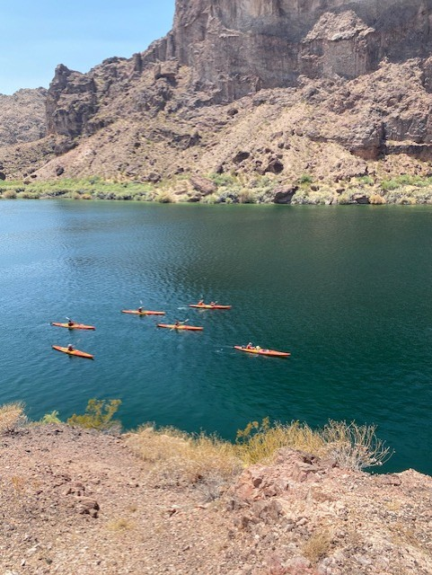
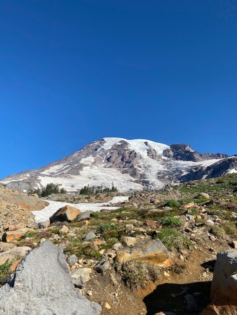

# Xtreme Adventure Tours 🌍✨

Live site: [https://anitria.github.io/XtremeAdventureTours/](https://anitria.github.io/XtremeAdventureTours/)

A fun, colorful static website built with **HTML, CSS, and JavaScript** to promote adventure travel packages.  
This project was developed as part of my **Web Development coursework at DePaul University (Fall 2024-2025)**.

---

## 🚀 Features
- **Hero Banner** with overlay text and call-to-action button  
- **Featured Tours** section with inviting tour cards (mountain, desert, jungle)  
- **About Section** highlighting value proposition  
- **Interactive Booking Form** (with simple JS alert confirmation)  
- **Responsive Design** using CSS grid & flexbox  
- **Playful Color Palette** (warm coral, teal, and sunshine yellow)  

---

## 🛠️ Tech Stack
- **HTML5** – semantic structure  
- **CSS3** – custom theme, grid, responsive design  
- **JavaScript** – interactivity (form handling, DOM events)  

---

## 📸 Screenshots
### Hero & Call to Action

### Featured Tours

*(Screenshots are placeholders – live site renders with uploaded images.)*

---

## 📌 Notes
- Developed as a **portfolio project for IS444: Web Development at DePaul University**  
- Images are stock/placeholder only  
